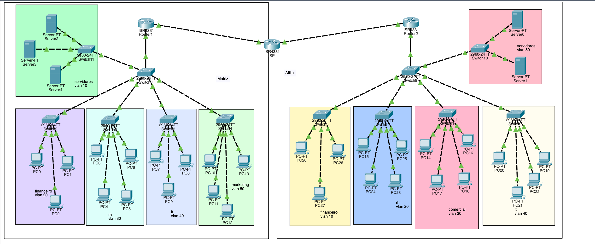

# Dois Escritórios + Servidores

## Contexto do projecto

Este projecto consiste na implementação de uma **infraestrutura de rede corporativa com duas localizações**, representando uma **Matriz e uma Filial**, interligadas através de uma rede WAN e com servidores internos.

A infraestrutura foi desenvolvida e testada no **Cisco Packet Tracer**, com o objectivo de simular uma organização empresarial onde diferentes departamentos possuem redes separadas, existe comunicação entre as duas localizações e são aplicadas políticas de routing, endereçamento e controlo de tráfego.

O principal objectivo foi compreender como diferentes tecnologias de redes podem ser integradas numa única infraestrutura, permitindo criar uma rede mais completa, organizada e funcional.

Do ponto de vista de administração de redes, o projecto foi desenvolvido para:

- Criar VLANs para segmentar diferentes departamentos.
- Configurar **Trunking IEEE 802.1Q** para transportar múltiplas VLANs.
- Implementar **Router-on-a-Stick** para realizar Inter-VLAN Routing.
- Configurar DHCP para atribuição automática de endereços IP.
- Implementar **OSPF** para routing dinâmico entre as diferentes redes.
- Configurar comunicação WAN entre a Matriz e a Filial.
- Implementar **NAT/PAT** para permitir o acesso à Internet.
- Utilizar **ACLs** para controlar o tráfego da rede.
- Realizar testes de conectividade e troubleshooting.
- Diagnosticar e resolver problemas relacionados com routing e NAT.

## Tecnologias utilizadas

- Cisco Packet Tracer
- Cisco IOS
- VLANs
- Trunking IEEE 802.1Q
- Router-on-a-Stick
- Inter-VLAN Routing
- DHCP
- OSPF
- NAT/PAT
- ACLs
- IPv4
- Subnetting
- WAN
- ICMP / Ping
- Routing
- Switching

# Resumo executivo

### Visão geral do projecto

O laboratório teve como objectivo implementar uma infraestrutura de rede corporativa composta por uma **Matriz e uma Filial**, permitindo a comunicação entre diferentes departamentos e servidores através de uma rede WAN.

A infraestrutura foi dividida através de **VLANs**, criando diferentes segmentos lógicos para os departamentos e servidores.

Na **Matriz**, foram configuradas as seguintes VLANs:

- VLAN 10 — Servidores
- VLAN 20 — Financeiro
- VLAN 30 — RH
- VLAN 40 — IT
- VLAN 50 — Marketing

Na **Filial**, foram configuradas:

- VLAN 10 — Financeiro
- VLAN 20 — RH
- VLAN 30 — Comercial
- VLAN 40 — IT
- VLAN 50 — Servidores

O **Router-on-a-Stick** foi utilizado para permitir a comunicação entre as diferentes VLANs através de subinterfaces configuradas no router.

O **DHCP** foi implementado para automatizar a configuração dos dispositivos, fornecendo endereços IP, máscaras de sub-rede, gateways e informações de DNS.

Para permitir a comunicação entre a Matriz e a Filial, foi utilizado **OSPF**, permitindo que os routers aprendessem dinamicamente as redes existentes em cada localização.

O **NAT/PAT** foi configurado para permitir que os dispositivos das redes internas pudessem utilizar uma interface WAN para acesso à Internet.

Também foram implementadas **ACLs** para controlar o tráfego e aplicar políticas de segurança.

### Principais conhecimentos adquiridos

1. **VLANs e segmentação da rede:**

   Aprendi a utilizar VLANs para separar logicamente diferentes departamentos e servidores, criando redes independentes dentro da mesma infraestrutura física.

   A utilização de VLANs permitiu organizar melhor a rede e reduzir os domínios de broadcast.

2. **Trunking IEEE 802.1Q:**

   Aprendi a configurar interfaces trunk para transportar tráfego de múltiplas VLANs através de uma única ligação física.

   Esta configuração foi necessária para permitir que as diferentes VLANs fossem transportadas entre switches e routers.

3. **Router-on-a-Stick e Inter-VLAN Routing:**

   Aprendi a utilizar subinterfaces num router para realizar o encaminhamento entre diferentes VLANs.

   Cada subinterface foi associada a uma VLAN através do protocolo `802.1Q` e configurada como gateway da respectiva rede.

4. **DHCP:**

   Aprendi a configurar DHCP para automatizar a atribuição de endereços IP aos dispositivos da rede.

   O serviço permitiu fornecer automaticamente:

   - Endereço IP;
   - Máscara de sub-rede;
   - Default Gateway;
   - Servidor DNS.

5. **OSPF:**

   Aprendi a utilizar o OSPF como protocolo de routing dinâmico.

   O OSPF permitiu que os routers da Matriz e da Filial trocassem informações sobre as redes disponíveis, evitando a necessidade de configurar manualmente todas as rotas.

6. **NAT/PAT:**

   Aprendi a configurar NAT Overload/PAT para permitir que vários dispositivos utilizando endereços IP privados pudessem partilhar um endereço IP da interface WAN para aceder à Internet.

7. **ACLs:**

   Aprendi a utilizar Access Control Lists para controlar o tráfego da rede.

   As ACLs permitiram criar regras específicas para determinar quais comunicações deveriam ser permitidas ou bloqueadas.

8. **Troubleshooting:**

   Aprendi a utilizar uma abordagem estruturada para identificar problemas de conectividade.

   Foram analisados componentes como VLANs, trunks, gateways, subinterfaces, OSPF, tabelas de routing, ACLs e traduções NAT.

# Análise aprofundada

### Categoria 1: Segmentação da rede

A infraestrutura foi dividida em diferentes VLANs para representar os departamentos e servidores existentes na Matriz e na Filial.

Na Matriz foram utilizadas cinco VLANs:

- VLAN 10 — Servidores
- VLAN 20 — Financeiro
- VLAN 30 — RH
- VLAN 40 — IT
- VLAN 50 — Marketing

Na Filial também foram utilizadas cinco VLANs:

- VLAN 10 — Financeiro
- VLAN 20 — RH
- VLAN 30 — Comercial
- VLAN 40 — IT
- VLAN 50 — Servidores

Cada VLAN possui uma rede IPv4 própria, permitindo separar logicamente os diferentes grupos de dispositivos.

  

A utilização de VLANs demonstrou como uma empresa pode utilizar a mesma infraestrutura física para criar diferentes redes lógicas, proporcionando maior organização e facilidade na aplicação de políticas de segurança.

### Categoria 2: Trunking e Router-on-a-Stick

Depois da criação das VLANs, foi necessário permitir que múltiplas VLANs fossem transportadas através das ligações entre os dispositivos de rede.

Para isso, foram configuradas interfaces em modo **trunk**, utilizando o padrão **IEEE 802.1Q**.

O Router-on-a-Stick foi utilizado para permitir que um único router realizasse o encaminhamento entre várias VLANs através de diferentes subinterfaces.

Cada subinterface foi associada a uma VLAN utilizando:

`encapsulation dot1Q`

Desta forma, o router passou a funcionar como gateway das diferentes redes internas.

### Categoria 3: Inter-VLAN Routing

O **Inter-VLAN Routing** permitiu estabelecer comunicação entre dispositivos pertencentes a VLANs diferentes.

Cada VLAN possui uma sub-rede própria e um gateway configurado no router.

Por exemplo, na Matriz:

- `10.0.10.0/24` — Servidores
- `10.0.20.0/24` — Financeiro
- `10.0.30.0/24` — RH
- `10.0.40.0/24` — IT
- `10.0.50.0/24` — Marketing

O router recebeu endereços de gateway correspondentes a cada uma dessas redes.

Esta configuração permitiu que os dispositivos pudessem comunicar entre diferentes VLANs quando o tráfego era permitido.

### Categoria 4: DHCP

O DHCP foi utilizado para automatizar a configuração dos dispositivos finais.

Em vez de configurar manualmente o endereço IP de cada computador, foram criados pools DHCP correspondentes às diferentes redes.

Os dispositivos receberam automaticamente informações como:

- Endereço IP;
- Máscara de sub-rede;
- Gateway padrão;
- DNS.

Durante os testes, também foi possível utilizar comandos de renovação de DHCP para verificar a atribuição de novos endereços IP aos dispositivos.

A utilização de DHCP tornou a administração da rede mais simples e reduziu a possibilidade de erros de configuração manual.

### Categoria 5: Routing dinâmico com OSPF

O **OSPF (Open Shortest Path First)** foi utilizado para estabelecer o routing dinâmico entre a Matriz, a Filial e a rede WAN.

A Matriz e a Filial foram interligadas através de uma rede WAN, utilizando ligações entre os routers.

Foram utilizadas redes `/30` nas ligações WAN, permitindo endereçar os dois lados de cada ligação de forma eficiente.

O OSPF foi configurado utilizando a **Area 0**.

A Matriz anunciou as suas redes internas `10.0.x.x`, enquanto a Filial anunciou as redes `10.1.x.x`.

Desta forma, os routers conseguiram aprender automaticamente as redes existentes na localização remota.

### Categoria 6: Comunicação WAN

A comunicação entre a Matriz e a Filial foi realizada através de uma infraestrutura WAN simulada.

A topologia utilizou uma rede intermédia para representar a ligação entre as duas localizações.

A comunicação WAN permitiu que dispositivos pertencentes às redes privadas da Matriz pudessem comunicar com dispositivos localizados nas redes privadas da Filial.

Através do OSPF, os routers conseguiram aprender as rotas necessárias para encaminhar o tráfego entre as duas redes corporativas.

### Categoria 7: NAT/PAT

O NAT/PAT foi implementado para permitir que os dispositivos das redes internas utilizassem a interface WAN para acesso à Internet.

Foi utilizado **NAT Overload**, permitindo que vários endereços IP privados fossem traduzidos utilizando o endereço IP da interface externa do router.

Inicialmente, foi utilizado um problema de configuração onde o NAT acabava por traduzir também o tráfego destinado à Filial.

Isto causava problemas na comunicação entre as duas redes privadas, pois o tráfego que deveria permanecer com os endereços internos era traduzido para o endereço da interface WAN.

### Categoria 8: ACLs e controlo de tráfego

As **ACLs (Access Control Lists)** foram utilizadas para controlar o tráfego da infraestrutura.

As ACLs permitiram definir quais pacotes deveriam ser permitidos ou bloqueados de acordo com a origem e o destino do tráfego.

Foram utilizadas regras capazes de distinguir entre:

- Redes internas;
- Redes remotas;
- Tráfego destinado à Internet;
- Tráfego entre a Matriz e a Filial.

A utilização de ACLs demonstrou como regras de controlo podem ser integradas com routing e NAT para implementar políticas de segurança.

### Categoria 9: Troubleshooting do NAT/PAT

Um dos principais desafios encontrados durante o projecto foi um problema relacionado com o **NAT Overload (PAT)**.

Durante os testes, verificou-se que a comunicação entre a Matriz e a Filial não funcionava correctamente, apesar de o OSPF e o routing entre as redes estarem configurados.

Foi realizada uma análise dos diferentes componentes da infraestrutura:

- VLANs;
- Trunks;
- Subinterfaces;
- Gateways;
- OSPF;
- Tabelas de routing;
- ACLs;
- Interfaces WAN;
- Traduções NAT.

A análise permitiu identificar que o NAT estava a traduzir o tráfego destinado à rede privada da Filial como se fosse tráfego destinado à Internet.

A solução consistiu em alterar a ACL utilizada pelo NAT para diferenciar o tráfego interno entre a Matriz e a Filial do tráfego destinado à Internet.

Foi utilizada uma **ACL estendida**, permitindo excluir o tráfego entre as redes privadas antes de aplicar o NAT ao restante tráfego.

Este problema foi uma das partes mais importantes do projecto, pois permitiu compreender na prática a relação entre **routing, ACLs e NAT/PAT**.

### Categoria 10: Testes de conectividade

Depois da implementação das configurações, foram realizados vários testes para verificar o funcionamento da infraestrutura.

Foram utilizados comandos de diagnóstico como:

- `show vlan brief`
- `show interfaces trunk`
- `show ip route`
- `show ip interface`
- `show ip ospf neighbor`
- `show access-lists`
- `show arp`
- `show ip nat translations`
- `show cdp neighbors`
- `show mac address-table dynamic`

Também foram realizados testes através do comando `ping` para validar a comunicação entre diferentes dispositivos e redes.

Os testes permitiram verificar:

- Comunicação dentro das VLANs;
- Comunicação entre VLANs;
- Comunicação entre Matriz e Filial;
- Funcionamento do OSPF;
- Funcionamento do DHCP;
- Funcionamento do NAT/PAT;
- Aplicação das ACLs;
- Conectividade com a rede externa.

# Resultado final

A implementação resultou numa **infraestrutura de rede corporativa composta por uma Matriz e uma Filial, com segmentação através de VLANs, routing dinâmico, serviços DHCP, NAT/PAT e controlo de tráfego através de ACLs**.

A infraestrutura permitiu:

- Comunicação entre os departamentos conforme as políticas definidas;
- Comunicação entre a Matriz e a Filial;
- Routing dinâmico através de OSPF;
- Atribuição automática de IPs através de DHCP;
- Acesso à Internet através de NAT/PAT;
- Controlo de tráfego através de ACLs;
- Comunicação com servidores;
- Segmentação da rede através de VLANs;
- Diagnóstico e resolução de problemas de conectividade.

O projecto permitiu consolidar conhecimentos de **VLANs, Trunking, Router-on-a-Stick, Inter-VLAN Routing, DHCP, OSPF, NAT/PAT, ACLs, IPv4, WAN e troubleshooting**, demonstrando como diferentes tecnologias podem ser integradas para construir uma infraestrutura de rede corporativa mais completa.

## Competências desenvolvidas

- Configuração de VLANs
- Segmentação de redes
- Trunking IEEE 802.1Q
- Router-on-a-Stick
- Inter-VLAN Routing
- Configuração de DHCP
- Routing dinâmico com OSPF
- Configuração de redes WAN
- NAT/PAT
- ACLs Standard e Extended
- Controlo de tráfego
- IPv4 e Subnetting
- Análise de tabelas de routing
- Análise de traduções NAT
- Troubleshooting de redes
- Diagnóstico de problemas de conectividade
- Administração de routers Cisco
- Administração de switches Cisco
- Utilização de Cisco IOS
- Utilização do Cisco Packet Tracer
- Testes de conectividade através de ICMP/Ping
